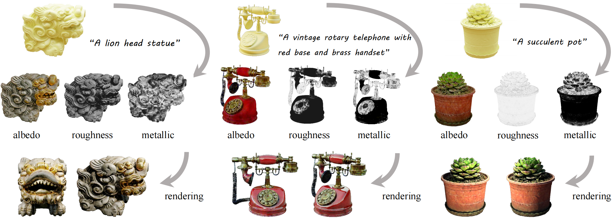
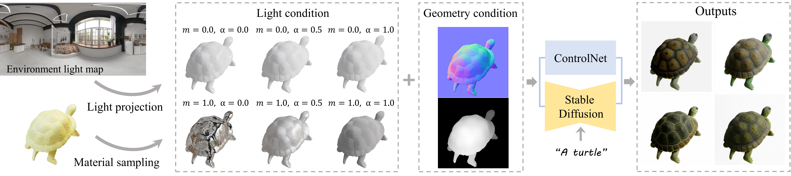

# DreamMat
DreamMat: High-quality PBR Material Generation with Geometry- and Light-aware Diffusion Models
## [Paper](https://arxiv.org) | [Project page](https://zzzyuqing.github.io/dreammat.github.io/) | [Dataset](https://zzzyuqing.github.io/dreammat.github.io/) | [Video](https://zzzyuqing.github.io/dreammat.github.io/) 



### Preparation for inference
1. Install packages in `requirements.txt`.
    We test our model on 3090/4090/V100/A6000 with 11.8 CUDA and 2.0.0 pytorch.
    ```
    git clone https://github.com/zzzyuqing/DreamMat.git
    cd DreamMat
    pip install -r requirements.txt
    ```
2. Install Blender 

    Download [blender-3.2.2-linux-x64.tar.xz](https://download.blender.org/release/Blender3.2/)
    
    Run:
    ```bash
    tar -xvf blender-3.2.2-linux-x64.tar.xz
    export PATH=$PATH:path_to_blender/blender-3.2.2-linux-x64
    ```


3. Download the pre-trained ControlNet checkpoints [here](https://pan.zju.edu.cn/share/5b7f4cd191248e775e693291a7) or from hugging face, put it to the path same as in `threestudio_dreammat/configs/dreammat.yaml`


### Inference

```
cd threestudio_dreammat
sh cmd/run_examples.sh
```

Upon initial execution, each model will undergo pre-rendering using Blender, with an approximate duration of 15 minutes on a 4090 GPU. During this period, there will be no output; thus, patience is requested. For subsequent runs, the `blender_generate` can be set to `false` to bypass this process.
### Geometry- and Light-aware ControlNet

#### Preparation for training
Make sure the environment map folder structure as
```bash
dataset
|-- <env_dir>
    |-- map1
        |-- map1.exr
    |-- map2
        |-- map2.exr
    |-- map3
        |-- map3.exr
    |-- map4
        |-- map4.exr
    |-- map5
        |-- map5.exr
```

Run the following code to generate pre-rendered data for training
```bash
cd controlnet_train
blender -b -P blender_script_geometry.py -- \
    --object_path ./dataset/model/046e3307c74746a58ec4bea5b33b7b97.glb \
    --output_dir ./dataset/training_data \
    --elevation 30 \
    --num_images 16


blender -b -P blender_script_light.py -- \
    --object_path ./dataset/model/046e3307c74746a58ec4bea5b33b7b97.glb \
    --env_dir ./dataset/envmap \
    --output_dir ./dataset/training_data \
    --elevation 30 \
    --num_images 16
```

The dataset folder structure will be as follows
```bash
dataset
|-- training_data
    |-- <uid_0>
        |-- color
            |-- 000_color_env1.png
            |-- ...
        |-- depth
            |-- 000.png
            |-- ...
        |-- light
            |-- 000_m0.0r0.0_env1.png
            |-- ...
        |-- normal
            |-- 000.png
            |-- ...
    |-- <uid_1>
    |-- ...
    
```

#### Training ControlNet

before training, make sure that the json file of prompts is in the format of 
```json
{
    "<uid_0>" : "<prompt_0>",
    "<uid_1>" : "<prompt_1>",
    "<uid_2>" : "<prompt_2>",
    ...
}
```


and the directory of training data is in the structure of
```bash
training_data
|-- <uid_0>
|-- <uid_1>
|-- <uid_2>
|-- ...

```
We provide several data as examples [here]().

run the training
```bash
cd controlnet_train
accelerate launch diffusers_train_controlnet.py --config config.json 
```


## Acknowledgement
We have intensively borrow codes from the following repositories. Many thanks to the authors for sharing their codes.
- [threestudio](https://github.com/threestudio-project/threestudio)
- [stable diffusion](https://github.com/CompVis/stable-diffusion)
- [CSD](https://github.com/CVMI-Lab/Classifier-Score-Distillation)
- [NeRO](https://github.com/liuyuan-pal/NeRO)
- [Fantasia3D](https://github.com/Gorilla-Lab-SCUT/Fantasia3D)
- [SyncDreamer](https://github.com/liuyuan-pal/SyncDreamer)
- [diffusers](https://github.com/huggingface/diffusers)
- [ControlNet](https://github.com/lllyasviel/ControlNet)

## Citation
If you find this repository useful in your project, please cite the following work. :)
```
@inproceedings{zhang2024dreammat,
  title={DreamMat: High-quality PBR Material Generation with Geometry- and Light-aware Diffusion Models},
  author={Zhang, Yuqing and Liu, Yuan and Xie, Zhiyu and Yang, Lei and Liu, Zhongyuan and Yang, Mengzhou and Zhang, Runze and Kou, Qilong and and Lin, Cheng and Wang, Wenping and Jin, Xiaogang},
  booktitle={SIGGRAPH},
  year={2024}
}
```
